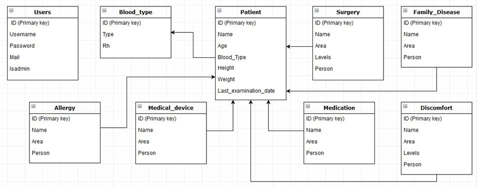

Developer Guide
===============

Database Design
---------------

Our website background consist of mainly Patient, Family_disease, Discomfort, Medical_device, Medication, Allergy and Surgery tables in the database.
Addictivly User and Blood_type tables are exist.
Patient table is the main table to store the basic informations about patients.
The other tables except User are used for detailed informations about the patients and include a foreign key of the patient table.
User table is used for keep login informations of doctors and admins.

Code
----

We done most of the operations in the server.py. We used @app.route methods to implement operations on back-end. 
All back-end operations are done in server.py. Front-end operations are implemented in server.py and the html files via jinja.
Also we used ajax in the add_patient.html file to implement some front-end operations.

Server.py:
----

In the server.py we used such operations below.
To start application:

.. code-block:: python

	#server.py

	@app.route("/")
	def home():
		return render_template('home.html')

To login the system:

.. code-block:: python

	#server.py
	
	@app.route("/login", methods=["GET", "POST"])
	def login():
		if request.method == "POST":
			uname = request.form["uname"]
			passw = request.form["passw"]

			state = "SELECT ID, ISADMIN, PASSWORD FROM USERS WHERE USERNAME='{}'".format(uname)
			with dbapi2.connect(db_url) as connection:
				cursor = connection.cursor()
				cursor.execute(state)
				record = cursor.fetchone()
				if record != None:
					if record[1]: # admin
						if hasher.verify(passw, record[2]):
							return redirect(url_for("admin_page"))
						else: ###################################### hatalı şifre
							render_template("login.html")
					else: # doctor
						if hasher.verify(passw, record[2]):
							return render_template('doctor.html', display="none")
						else:  ###################################### hatalı şifre
							render_template("login.html")
		return render_template("login.html")

To register the system:

.. code-block:: python

	#server.py	  

	@app.route("/register", methods=["GET", "POST"])
	def register():
		if request.method == "POST":
			uname = request.form['uname']
			state = "SELECT ID FROM USERS WHERE USERNAME='{}'".format(uname)
			with dbapi2.connect(db_url) as connection:
				cursor = connection.cursor()
				cursor.execute(state)
				record = cursor.fetchone()
				cursor.close()
			if record == None:
				mail = request.form['mail']
				passw = request.form['passw']
				hashed = hasher.hash(passw)
				state = "INSERT INTO USERS(USERNAME, PASSWORD, MAIL) VALUES('{}','{}','{}') ".format(uname, hashed, mail)
				with dbapi2.connect(db_url) as connection:
					cursor = connection.cursor()
					cursor.execute(state)
					cursor.close()
			else:
				return render_template("register.html")
			return redirect(url_for("login"))
		return render_template("register.html")

If admin is entered the system this function directing him/her the admin page:

.. code-block:: python

	#server.py
	
	@app.route("/admin", methods=["GET", "POST"])
	def admin_page():
		return render_template('admin.html', display="none")

If a user entered the system this function directing him/her the doctor page:

.. code-block:: python

	#server.py
		
	@app.route("/doctor", methods=["GET", "POST"])
	def doctor_page():
		return render_template('doctor.html', display="none")

Doctors who clicks add new patient button are directed the add patient page via this function:

.. code-block:: python

	#server.py
	
	@app.route("/add_patient")
	def add_patient():
		return render_template('add_patient.html')
		
Admins can see all patients on the admin page via this function:

.. code-block:: python

	#server.py
	@app.route("/ShowAllPatients/",  methods=['GET', 'POST'])
	def show_patients():
		state = "SELECT ALL * FROM PATIENT"
		with dbapi2.connect(db_url) as connection:
			cursor = connection.cursor()
			cursor.execute(state)
			patients = cursor.fetchall()
			cursor.close()
		return render_template('admin.html', patients=patients, display="visible", sel = 'p')

Admins can see all doctors on the admin page via this function:
	
.. code-block:: python

	#server.py
	
	@app.route("/ShowAllUsers/",  methods=['GET', 'POST'])
	def show_users():
		state = "SELECT ALL * FROM USERS"
		with dbapi2.connect(db_url) as connection:
			cursor = connection.cursor()
			cursor.execute(state)
			users = cursor.fetchall()
			cursor.close()
		return render_template('admin.html', users=users, display="visible", sel='u')

		
Admins who want to delete a patient can delete a patient via this function:

.. code-block:: python

	#server.py

	@app.route("/del_patient/<int:patient_id>",  methods=['GET', 'POST'])
	def del_patient(patient_id):
		state = "DELETE FROM PATIENT WHERE ID={}".format(patient_id)
		with dbapi2.connect(db_url) as connection:
			cursor = connection.cursor()
			cursor.execute(state)
			cursor.close()
		return redirect(url_for('show_patients'))
		
		
Admins who want to delete a user can delete him/her via this function:

.. code-block:: python

	#server.py
	@app.route("/del_user/<int:user_id>",  methods=['GET', 'POST'])
	def del_user(user_id):
		state = "DELETE FROM USERS WHERE ID={}".format(user_id)
		with dbapi2.connect(db_url) as connection:
			cursor = connection.cursor()
			cursor.execute(state)
			cursor.close()
		return redirect(url_for('show_users'))

Admins can exit the page via this function:

.. code-block:: python

	#server.py
	
	@app.route("/Exit/",  methods=['GET', 'POST'])
	def Exit():
		return render_template('home.html')

When doctors fills information about patients and clicks save button the patient added the system via this function:

.. code-block:: python

	#server.py

	@app.route("/add_new_patient/", methods=['GET', 'POST'])
	def add_new_patient():
		bloody = request.form["blood"]
		blood_new = "null"

		if (bloody != ""):
			if bloody == "AB+":
				blood_new = 1
			elif bloody == "AB-":
				blood_new = 2
			elif bloody == "0+":
				blood_new = 3
			elif bloody == "0-":
				blood_new = 4
			elif bloody == "A+":
				blood_new = 5
			elif bloody == "AB-":
				blood_new = 6
			elif bloody == "B+":
				blood_new = 7
			elif bloody == "B-":
				blood_new = 8
			else:
				blood_new = "null"
		statements = ["INSERT INTO PATIENT(NAME, AGE, WEIGHT, HEIGHT, LAST_EXAMINATION_DATE, "
					  "BLOOD_TYPE) VALUES('{}', {}, {}, {}, '{}', {}) RETURNING ID".format(request.form["name"], request.form["age"],
																			  request.form["weight"],
																			  request.form["height"], request.form["exam_date"],
																			  blood_new)]
		with dbapi2.connect(db_url) as connection:
			cursor = connection.cursor()
			cursor.execute(statements[0])
			x = cursor.fetchone()
			cursor.close()
		statements = []
		if request.form["fam_dis"] != "":
			state = "INSERT INTO FAMILY_DISEASE(NAME, AREA, PERSON) VALUES('{}', '{}', {})".format(request.form["fam_dis"],
																								   request.form["fam_area"],
																								   x[0])
			statements.append(state)
		if int(request.form["fam_dis_num"]) != 0:
			for i in range(int(request.form["fam_dis_num"])):
				state = "INSERT INTO FAMILY_DISEASE(NAME, AREA, PERSON) VALUES('{}', '{}', {})".format(request.form["fam_dis" + str(i)],
																									   request.form["fam_area" + str(i)],
																									   x[0])
				statements.append(state)
		if request.form["disco"] != "":
			state = "INSERT INTO DISCOMFORT(NAME, AREA, LEVELS, PERSON) VALUES('{}', '{}', {}, {})".format(request.form["disco"],
																								   request.form["disco_area"], request.form["disco_level"],
																								   x[0])
			statements.append(state)
		if int(request.form["disco_number"]) != 0:
			for i in range(int(request.form["disco_number"])):
				state = "INSERT INTO DISCOMFORT(NAME, AREA, LEVELS, PERSON) VALUES('{}', '{}', {}, {})".format(request.form["disco" + str(i)],
																								  request.form["disco_area" + str(i)], request.form["disco_level" + str(i)], x[0])
				statements.append(state)
		if request.form["med_dev"] != "":
			state = "INSERT INTO MEDICAL_DEVICE(NAME, AREA, PERSON) VALUES('{}', '{}', {})".format(request.form["med_dev"],
																								   request.form["med_dev_area"],
																								   x[0])
			statements.append(state)
		if int(request.form["med_dev_number"]) != 0:
			for i in range(int(request.form["med_dev_number"])):
				state = "INSERT INTO MEDICAL_DEVICE(NAME, AREA, PERSON) VALUES('{}', '{}', {})".format(request.form["med_dev" + str(i)],
																									   request.form["med_dev_area" + str(i)],
																									   x[0])
				statements.append(state)
		if request.form["medi"] != "":
			state = "INSERT INTO MEDICATION(NAME, USAGES, PERSON) VALUES('{}', '{}', {})".format(request.form["medi"],
																								   request.form["medi_area"],
																								   x[0])
			statements.append(state)
		if int(request.form["medi_number"]) != 0:
			for i in range(int(request.form["medi_number"])):
				state = "INSERT INTO MEDICATION(NAME, USAGES, PERSON) VALUES('{}', '{}', {})".format(request.form["medi" + str(i)],
																									   request.form["medi_area" + str(i)],
																									   x[0])
				statements.append(state)
		if request.form["surge"] != "":
			state = "INSERT INTO SURGERY(NAME, AREA, LEVELS, PERSON) VALUES('{}', '{}', {}, {})".format(request.form["surge"],
																								   request.form["surge_area"], request.form["surge_level"],
																								   x[0])
			statements.append(state)
		if int(request.form["surge_number"]) != 0:
			for i in range(int(request.form["surge_number"])):
				state = "INSERT INTO SURGERY(NAME, AREA, LEVELS, PERSON) VALUES('{}', '{}', {}, {})".format(request.form["surge" + str(i)],
																									   request.form["surge_area" + str(i)], request.form["surge_level" + str(i)],
																									   x[0])
				statements.append(state)
		if request.form["allergy"] != "":
			state = "INSERT INTO ALLERGY(NAME, AREA, PERSON) VALUES('{}', '{}', {})".format(request.form["allergy"],
																								   request.form["allergy_area"],
																								   x[0])
			statements.append(state)
		if int(request.form["allergy_number"]) != 0:
			for i in range(int(request.form["allergy_number"])):
				state = "INSERT INTO ALLERGY(NAME, AREA, PERSON) VALUES('{}', '{}', {})".format(request.form["allergy" + str(i)],
																									   request.form["allergy_area" + str(i)],
																									   x[0])
				statements.append(state)

		with dbapi2.connect(db_url) as connection:
			cursor = connection.cursor()
			for state in statements:
				cursor.execute(state)
			cursor.close()

		return render_template('doctor.html', name="", age="", weight="", height="",
									examinate_date="", blood_type="", family_diseases="", discomforts="",
									medications="", surgeries="", medical_device="", allergies="", uw='n', display="none",
									display_wei="none", display_fam="none", uf='n', display_fam_ad="none",
									display_fam_del="none")

When doctors check a patient by id in the doctor page can see informations of the patient (if exist in the database) via this function:

.. code-block:: python

	#server.py
	
	@app.route('/check/',  methods=['GET', 'POST'])
	def check():
		global blood, age, name, weight, height, aller, med_dev, surge, medi, discomp, family_diseases, exam
		array = []
		global id
		id = request.form["id"]
		statements = ["SELECT WEIGHT FROM PATIENT WHERE ID={}".format(request.form["id"]),
					 "SELECT HEIGHT FROM PATIENT WHERE ID={}".format(request.form["id"]),
					 "SELECT NAME FROM PATIENT WHERE ID={}".format(request.form["id"]),
					 "SELECT AGE FROM PATIENT WHERE ID={}".format(request.form["id"]),
					 "SELECT NAME, AREA FROM ALLERGY WHERE PERSON={}".format(request.form["id"]),
					 "SELECT LAST_EXAMINATION_DATE FROM PATIENT WHERE ID={}".format(request.form["id"]),
					 "SELECT BLOOD_TYPE FROM PATIENT WHERE ID={}".format(request.form["id"]),
					 "SELECT NAME, AREA, LEVELS FROM DISCOMFORT WHERE PERSON={}".format(request.form["id"]),
					 "SELECT NAME, USAGES FROM MEDICATION WHERE PERSON={}".format(request.form["id"]),
					 "SELECT NAME, AREA FROM MEDICAL_DEVICE WHERE PERSON={}".format(request.form["id"]),
					 "SELECT NAME, AREA, LEVELS FROM SURGERY WHERE PERSON={}".format(request.form["id"]),
					 "SELECT NAME, AREA FROM FAMILY_DISEASE WHERE PERSON={}".format(request.form["id"])
					 ]

		with dbapi2.connect(db_url) as connection:
			cursor = connection.cursor()
			for state in statements:
				cursor.execute(state)
				array.append(cursor.fetchall())
			cursor.close()
			if(array[6] != [] ):
				if (array[6][0][0] == 1):
					blood = "AB+"
				elif (array[6][0][0] == 2):
					blood = "AB-"
				elif (array[6][0][0] == 3):
					blood = "0+"
				elif (array[6][0][0] == 4):
					blood = "0-"
				elif (array[6][0][0] == 5):
					blood = "A+"
				elif (array[6][0][0] == 6):
					blood = "AB-"
				elif (array[6][0][0] == 7):
					blood = "B+"
				elif (array[6][0][0] == 8):
					blood = "B-"
				else:
					blood = ""
					############################################
			family_diseases = list()
			for i in array[11]:
				family_diseases.append(i[0] + " area: " + i[1])
			discomp = list()
			for i in array[7]:
				discomp.append(i[0] + " area: " + i[1] + " level: " + str(i[2]))
			medi = list()
			for i in array[8]:
				medi.append(i[0] + " usage: " + i[1])
			surge = list()
			for i in array[10]:
				surge.append(i[0] + " area: " + i[1] + " level: " + str(i[2]))
			med_dev = list()
			for i in array[9]:
				med_dev.append( i[0]  + " area: " + i[1])
			aller = list()
			for i in array[4]:
				aller.append( i[0] + " area: " + i[1])

				###############################################################
			if (array[1] != []):
				height = array[1][0][0]
			else:
				height = "-"
			if (array[0] != []):
				weight = array[0][0][0]
			else:
				weight = "-"
			if (array[5] != []):
				exam = array[5][0][0]
			else:
				exam = "no_date"
		if (array[2] == []):
			return render_template('doctor.html', name="", age="", weight="", height="",
							   examinate_date="", blood_type="", family_diseases="", discomforts="", display_blood="none", upblood='n',
							   medications="", surgeries="", medical_device="", allergies="", uw='n', uphei='n', display_hei="none",
							   display="none", display_wei="none", display_fam="none", uf='n', display_date="none", up_exam_date="n", display_fam_ad="none",
							   display_fam_del="none", no_res="Patient didn't found!")
		else:
			name = array[2][0][0]
			age = array[3][0][0]
			return render_template('doctor.html', name=array[2][0][0], age=array[3][0][0], weight=weight, height=height,
							   examinate_date=exam, blood_type=blood, family_diseases=family_diseases, discomforts=discomp, updisco='n',
								   display_med_dev="none", display_med_dev_ad="none", display_med_dev_del="none",
								   upmed_dev='n', display_aller="none", display_aller_ad="none", display_aller_del="none", upaller='n',
							   medications=medi, surgeries=surge, medical_device=med_dev, uphei='n', display_hei="none", display_blood="none", upblood='n',
							   allergies=aller, display_date="none", up_exam_date="n", uw='n', display="visible", display_wei="none", display_fam="none",
							   uf='n', display_fam_ad="none", display_fam_del="none", display_disco="none", display_disco_ad="none", display_disco_del="none", display_medi="none",
							   display_medi_ad="none", display_medi_del="none", upmedi='n', display_surge="none", display_surge_ad="none", display_surge_del="none", upsurge='n',)

Doctors can update weight, height, blood_type and last_examination_date properties of patients. Example function is placed below.

.. code-block:: python

	#server.py

	@app.route("/Update_wei/", methods=['GET', 'POST'])
	def update_wei():
		global count, height, weight, age, name, exam, blood, family_diseases, discomp, medi, surge, med_dev, aller
		if (count == 0):
			count = 1
			return render_template('doctor.html', name=name, age=age, weight=weight, height=height,
									examinate_date=exam, blood_type=blood, family_diseases=family_diseases, discomforts=discomp,
									medications=medi, surgeries=surge, medical_device=med_dev, allergies=aller, uw='y',
								   display_med_dev="none", display_med_dev_ad="none", display_med_dev_del="none",
								   upmed_dev='n', display_aller="none", display_aller_ad="none", display_aller_del="none", upaller='n',
									display="visible", display_wei="visible", display_fam="none", uf='n', display_fam_ad="none",
									display_fam_del="none", uphei='n', display_hei="none", display_blood="none", upblood='n',display_date="none", up_exam_date="n",
									display_disco="none", display_disco_ad="none", display_disco_del="none", updisco='n', display_medi="none",
								   display_medi_ad="none", display_medi_del="none", upmedi='n', display_surge="none", display_surge_ad="none", display_surge_del="none", upsurge='n',)
		else :
			count = 0
			old_wei = weight
			weight = request.form["new_weight"]
			if (weight != ""):
				state = "UPDATE PATIENT SET WEIGHT={} WHERE ID={}".format(weight, id)
				with dbapi2.connect(db_url) as connection:
					cursor = connection.cursor()
					cursor.execute(state)
					cursor.close()
			else:
				weight = old_wei
			return render_template('doctor.html', name=name, age=age, weight=weight, height=height,
									examinate_date=exam, blood_type=blood, family_diseases=family_diseases, discomforts=discomp,
									medications=medi, surgeries=surge, medical_device=med_dev, allergies=aller, uw='n',
								   display_med_dev="none", display_med_dev_ad="none", display_med_dev_del="none",
								   upmed_dev='n', display_aller="none", display_aller_ad="none", display_aller_del="none", upaller='n',
									display="visible", display_wei="none", display_fam="none", uf='n', display_fam_ad="none",
									display_fam_del="none", uphei='n', display_hei="none", display_blood="none", upblood='n',display_date="none", up_exam_date="n",
									display_disco="none", display_disco_ad="none", display_disco_del="none", updisco='n', display_medi="none",
								   display_medi_ad="none", display_medi_del="none", upmedi='n', display_surge="none", display_surge_ad="none", display_surge_del="none", upsurge='n',)

Doctors can delete a familiy disease via the function below. Surgery, Medical Devices, Allergies, Medications and Discomforts elements are also deleted via similar functions.

.. code-block:: python

	#server.py
	
	@app.route("/Delete_fam/", methods=['GET', 'POST'])
	def delete_fam():
		global delete_fam_count, family_diseases
		if (delete_fam_count == 0):
			if family_diseases == "-" or family_diseases == []:
				return render_template('doctor.html', name=name, age=age, weight=weight, height=height,
									   examinate_date=exam, blood_type=blood, family_diseases=family_diseases,
									   discomforts=discomp, display_medi="none", display_medi_ad="none", display_medi_del="none", upmedi='n',
									   medications=medi, surgeries=surge, medical_device=med_dev, updisco='n',
									   allergies=aller, uw='n', display="visible", display_wei="none", display_fam="none",
									   uf='n', display_fam_ad="none", display_blood="none", upblood='n',  uphei='n', display_hei="none", display_date="none", up_exam_date="n",
									   display_fam_del="none", display_disco="none", display_disco_ad="none", display_disco_del="none",
									   display_med_dev="none", display_med_dev_ad="none", display_med_dev_del="none",
									   upmed_dev='n', display_aller="none", display_aller_ad="none", display_aller_del="none", upaller='n',
									   display_surge="none", display_surge_ad="none", display_surge_del="none", upsurge='n')
			else:
				delete_fam_count = 1
				return render_template('doctor.html', name=name, age=age, weight=weight, height=height,
									examinate_date=exam, blood_type=blood, family_diseases=family_diseases, discomforts=discomp,
									   display_med_dev="none", display_med_dev_ad="none", display_med_dev_del="none",
									   upmed_dev='n', display_aller="none", display_aller_ad="none", display_aller_del="none", upaller='n',
									medications=medi, surgeries=surge, medical_device=med_dev, allergies=aller, uw='n',
									display="visible", display_wei="none", display_fam="none", uf='n', display_fam_ad="none",
									   display_blood="none", upblood='n', uphei='n', display_hei="none",
									   display_date="none", up_exam_date="n", updisco='n', display_medi="none", display_medi_ad="none", display_medi_del="none", upmedi='n',
									display_fam_del="visible", display_disco="none", display_disco_ad="none", display_disco_del="none",
									   display_surge="none", display_surge_ad="none", display_surge_del="none", upsurge='n')
		else :
			delete_fam_count = 0
			statement = []
			for x in request.form.getlist("OK"):
				y = x.split(" area: ")
				statement.append("DELETE FROM FAMILY_DISEASE WHERE NAME='{}'".format(y[0]))
				family_diseases.remove(x)
			with dbapi2.connect(db_url) as connection:
				cursor = connection.cursor()
				for state in statement:
					cursor.execute(state)
				cursor.close()
			return render_template('doctor.html', name=name, age=age, weight=weight, height=height,
								   examinate_date=exam, blood_type=blood, family_diseases=family_diseases,
								   discomforts=discomp, display_blood="none", upblood='n',  uphei='n', display_hei="none", display_date="none", up_exam_date="n",
								   medications=medi, surgeries=surge, medical_device=med_dev, allergies=aller, uw='n',
								   display="visible", display_wei="none", display_fam="none", uf='n', display_fam_ad="none",
								   display_surge="none", display_surge_ad="none", display_surge_del="none", upsurge='n',
								   display_med_dev="none", display_med_dev_ad="none", display_med_dev_del="none",
								   upmed_dev='n', display_aller="none", display_aller_ad="none", display_aller_del="none", upaller='n',
								   display_disco="none", display_disco_ad="none", display_disco_del="none",
								   display_fam_del="none", updisco='n', display_medi="none", display_medi_ad="none", display_medi_del="none", upmedi='n')

Doctors can update a familiy disease via the method below. Surgery, Medical Devices, Allergies, Medications and Discomforts elements are also updated via similar functions.

.. code-block:: python

	#server.py
	
	@app.route("/Update_fam/", methods=['GET', 'POST'])
	def update_fam():
		global count_fam, family_diseases
		if (count_fam == 0):
			count_fam = 1
			return render_template('doctor.html', name=name, age=age, weight=weight, height=height,
									examinate_date=exam, blood_type=blood, family_diseases=family_diseases, discomforts=discomp,
									medications=medi, surgeries=surge, medical_device=med_dev, allergies=aller, uw='n',
								   display_med_dev="none", display_med_dev_ad="none", display_med_dev_del="none",
								   upmed_dev='n', display_aller="none", display_aller_ad="none", display_aller_del="none", upaller='n',
									display="visible", display_wei="none", display_fam="visible", uf='y', display_fam_ad="none",
									display_blood="none", upblood='n', uphei='n', display_hei="none", display_date="none", updisco='n',
									up_exam_date="n", display_fam_del="none", display_disco="none", display_disco_ad="none", display_disco_del="none",
									display_surge = "none", display_surge_ad = "none", display_surge_del = "none", upsurge = 'n',
									display_medi="none", display_medi_ad="none", display_medi_del="none", upmedi='n')
		else :
			count_fam = 0
			i = 0
			statement = []
			if family_diseases == "-" or family_diseases == []:
				if (request.form["fam_dis"] != ""):
					family_diseases.append(request.form["fam_dis"] + " area: " + request.form["area"])
					ad = id
					statement.append("INSERT INTO FAMILY_DISEASE(NAME, AREA, PERSON) VALUES('{}', '{}', {})".format(request.form["fam_dis"],
																										request.form["area"], ad))
			else:
				for fam in family_diseases:
					x = fam.split(' area: ')
					if (request.form[x[0]] != ""):
						old_name = x[0]
						family_diseases[i] = (request.form[x[0]] + " area: " + request.form[x[1]])
						statement.append("UPDATE FAMILY_DISEASE SET NAME='{}', AREA='{}' WHERE NAME='{}'".format(request.form[x[0]], request.form[x[1]], old_name))
					i+=1

			with dbapi2.connect(db_url) as connection:
				cursor = connection.cursor()
				for state in statement:
					cursor.execute(state)
				cursor.close()
			return render_template('doctor.html', name=name, age=age, weight=weight, height=height,
									examinate_date=exam, blood_type=blood, family_diseases=family_diseases, discomforts=discomp,
									medications=medi, surgeries=surge, medical_device=med_dev, allergies=aller, uw='n',
									display="visible", display_wei="none", display_fam="none", uf='n', display_fam_ad="none",
								   display_blood="none", upblood='n', uphei='n', display_hei="none", display_date="none",
								   display_med_dev="none", display_med_dev_ad="none", display_med_dev_del="none",
								   upmed_dev='n', display_aller="none", display_aller_ad="none", display_aller_del="none", upaller='n',
								   up_exam_date="n", display_disco="none", display_disco_ad="none", display_disco_del="none",
								   display_surge="none", display_surge_ad="none", display_surge_del="none", upsurge='n',
									display_fam_del="none", updisco='n', display_medi="none", display_medi_ad="none", display_medi_del="none", upmedi='n')
	
Doctors can add a familiy disease via the function below. Surgery, Medical Devices, Allergies, Medications and Discomforts elements are also added via similar functions.

.. code-block:: python

	#server.py
	
	@app.route("/Add_fam/", methods=['GET', 'POST'])
	def add_fam():
		global count_add_fam, family_diseases
		if count_add_fam == 0:
			count_add_fam = 1
			return render_template('doctor.html', name=name, age=age, weight=weight, height=height,
								   examinate_date=exam, blood_type=blood, family_diseases=family_diseases,
								   discomforts=discomp, medications=medi, surgeries=surge, medical_device=med_dev,
								   allergies=aller, uw='n', display="visible", display_wei="none", display_fam="none",
								   display_blood="none", upblood='n', uphei='n', display_hei="none", display_date="none",
								   up_exam_date="n", display_disco="none", display_disco_ad="none", display_disco_del="none",
								   uf='n', display_fam_ad="visible", display_fam_del="none", updisco='n',
								   display_med_dev="none", display_med_dev_ad="none", display_med_dev_del="none",
								   upmed_dev='n', display_aller="none", display_aller_ad="none", display_aller_del="none", upaller='n',
								   display_surge="none", display_surge_ad="none", display_surge_del="none", upsurge='n',
								   display_medi="none", display_medi_ad="none", display_medi_del="none", upmedi='n')
		else:
			count_add_fam = 0
			if request.form["new_fam"] != "":
				family_diseases.append(request.form["new_fam"] + " area: " + request.form["fam_area"])
				ad = id
				state = "INSERT INTO FAMILY_DISEASE(NAME, AREA, PERSON) VALUES('{}', '{}', {})".format(request.form["new_fam"], request.form["fam_area"], ad)
				with dbapi2.connect(db_url) as connection:
					cursor = connection.cursor()
					cursor.execute(state)
					cursor.close()
			return render_template('doctor.html', name=name, age=age, weight=weight, height=height,
								   examinate_date=exam, blood_type=blood, family_diseases=family_diseases,
								   discomforts=discomp, medications=medi, surgeries=surge, medical_device=med_dev,
								   allergies=aller, uw='n', display="visible", display_wei="none", display_fam="none",
								   display_blood="none", upblood='n', uphei='n', display_hei="none", display_date="none",
								   up_exam_date="n", uf='n', display_fam_ad="none", display_fam_del="none",
								   display_med_dev="none", display_med_dev_ad="none", display_med_dev_del="none",
								   upmed_dev='n', display_aller="none", display_aller_ad="none", display_aller_del="none", upaller='n',
								   display_disco="none", display_disco_ad="none", display_disco_del="none", updisco='n',
								   display_surge="none", display_surge_ad="none", display_surge_del="none", upsurge='n',
								   display_medi="none", display_medi_ad="none", display_medi_del="none", upmedi='n')

Jinja:
----

To show buttons and contents of weight property we used the method below. Also contents of Examination date, Blood_type, Height properties implemented similar methods.

.. code-block:: jinja & html

	#doctor.html
	
	<tr>
		<td><b>Weight:</b> {{ weight }}
			<form style="display:{{display_wei}}" action="/Update_wei/" method="post">
				<input type="number" step="0.01" placeholder="{{ weight }}" name="new_weight">
				<button type="submit">OK</button>
			</form>
		</td>
		<td> 
			 
			<form style="display:{{disp_w}}" action="/Update_wei/" method="post">
				<button type="submit">Update</button>
			</form>
		</td>

		<td><b>Height:</b> {{ height }}
			<form style="display:{{display_hei}}" action="/Update_hei/" method="post">
				<input type="number" step="0.01" placeholder="{{ height }}" name="new_height">
				<button type="submit">OK</button>
			</form>
		</td>
		<td> 
			 
			<form style="display:{{disp_hei}}" action="/Update_hei/" method="post">
				<button type="submit">Update</button>
			</form>
		</td>
	</tr>

To show buttons and contents of familiy_diseases property we used the method below. Also contents of Allergy, Discomfort, Medical_device, Medication and Surgery properties implemented similar methods.

.. code-block:: jinja & html

	#doctor.html

	<td><b>Family Diseases:</b>
		
			<form style="display:{{display_fam}}" action="/Update_fam/" method="post">
				<input type="text" name="fam_dis">
				<label><b>Area:</b></label>
				<input type="text" name="area">
				<button type="submit">OK</button>
			</form>
			 
		
		
			<ol>
				
					
						
						<li> {{ fam_dis }}</li>
						
					
				
			</ol>
		<form style="display:{{display_fam_del}}" action="/Delete_fam/" method="post">
				
					<input type="checkbox" name="OK" value="{{ fam_dis }}">{{ fam_dis }} 
				
			<input type="submit" value="OK">
		</form>
			<form style="display:{{display_fam}}" action="/Update_fam/" method="post">
				<ol>
				
				
					<li>
						<input type="text" placeholder="{{fam[0]}}" name="{{fam[0]}}">
						<label><b>Area:</b></label>
						<input type="text" placeholder="{{fam[1]}}" name="{{fam[1]}}">
					</li>
					
				
				</ol>
				<button type="submit">OK</button>
			</form>
		
		<form style="display:{{display_fam_ad}}" action="/Add_fam/" method="post">
			<label><b>Name:</b></label>
			<input type="text"  name="new_fam">
			<label><b>Area:</b></label>
			<input type="text" name="fam_area">
			<button type="submit">OK</button>
		</form>
	</td>
		

Ajax:
----

To add new line boxes in some properties via plus and minus buttons, that script is used. 
		
.. code-block:: ajax

	#add_patient.html
	
	
	
	
	
.. toctree::

   member1
   member2
