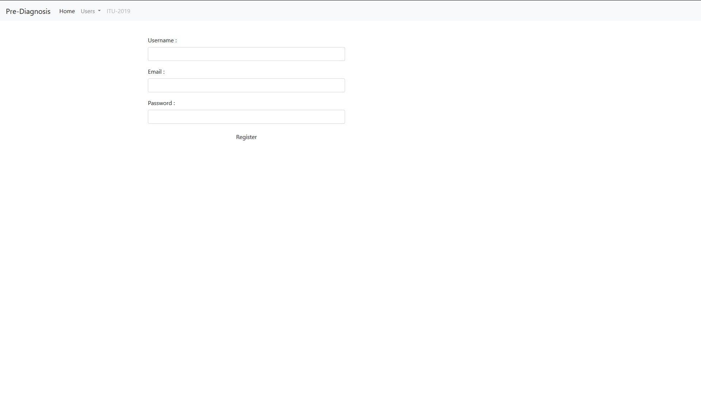
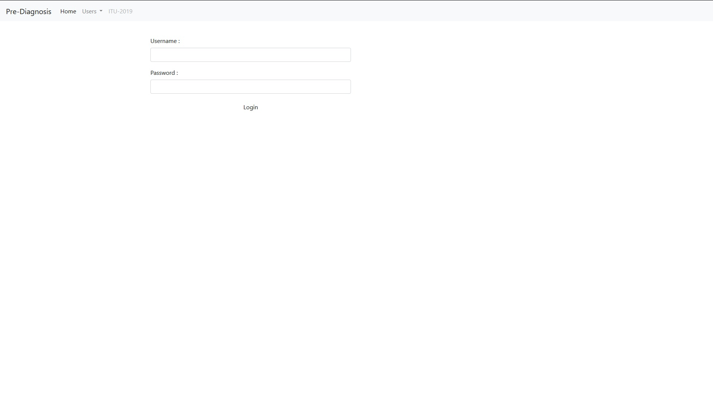
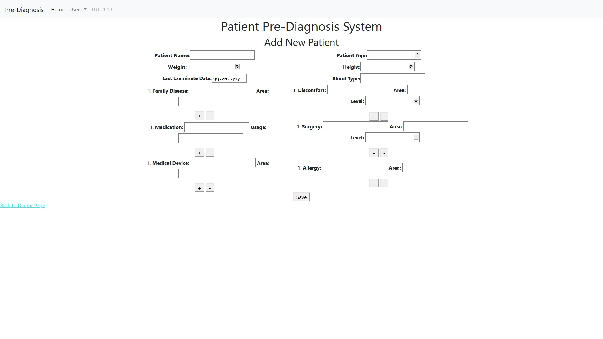
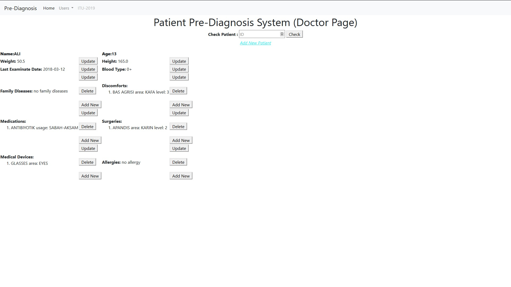
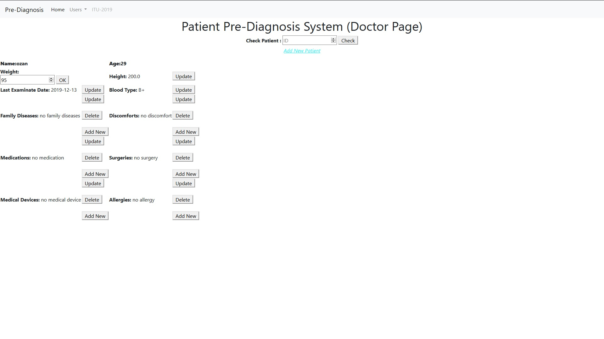
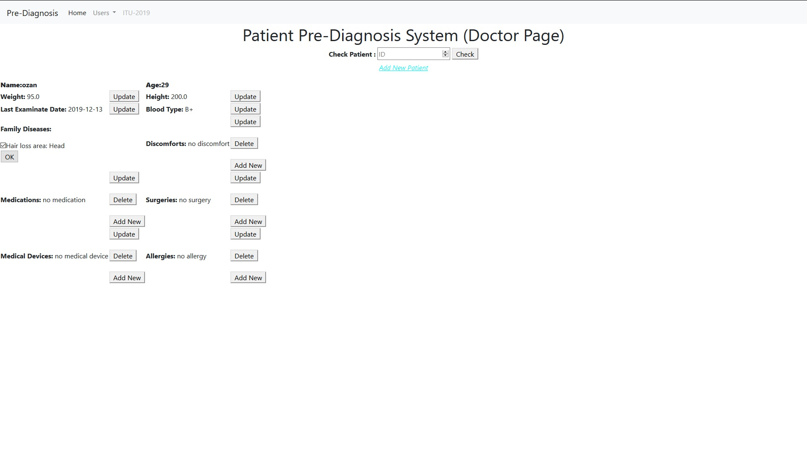
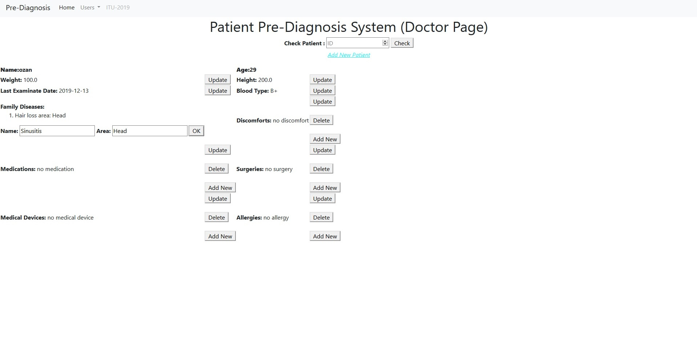
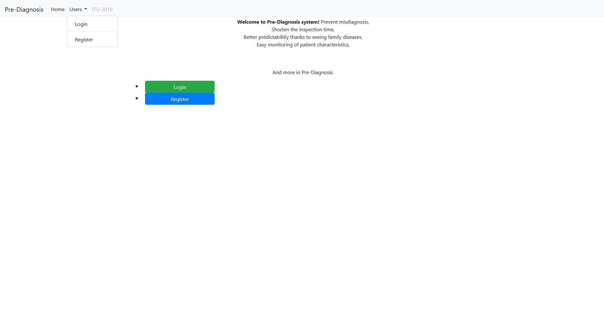

User Guide
==========

User can register with enter required information in register page [1]. 

  
  Register page [1].
  
Then with this information user can login in login page [2]. 

  
  Login page [2].

User can check patient that desired to see information with box in the doctor page with entered the patient's ID. 
If there is new patient , user can add the patient to database with add patient link [3].
  

  
  Add new patient on Doctor page [3].
  
User can edit patient information. 
For edit operation user checks patient id that desired then use buttons near to subject that want to edit [4].

  
  CRUD operations on patient [4].

User can change old data with new one by update button. 
When user click update button box(s) appears and new data entered to box(s) [5]. 

  
  Update operations on patient [5].

User can delete patient's data. User clicks delete button and select data that will be deleted [6].

  
  Delete operations on patient [6].

User can add multiple data to one subject with add new button [7]. 
  

  
  Add operations on patient [7].

Finally, user can access home, login and register pages with links on the bar that top of the screen easily [8].

  
  Navigation Bar [8].

.. toctree::

   member1
   member2
   